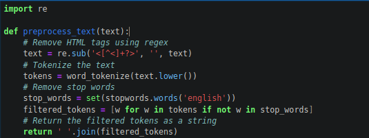
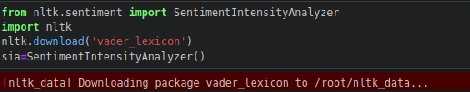
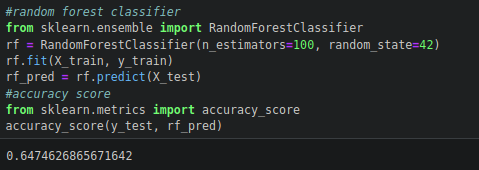
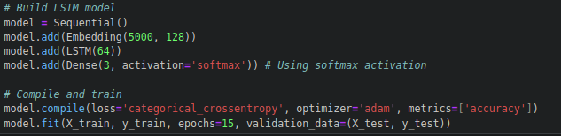
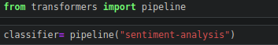

# Sentiment Analysis

This project aims to analyze the sentiment of sentences using various machine learning techniques. It leverages libraries such as **NLTK**, **scikit-learn**, **Transformers**, and **Keras** to predict the sentiment of input sentences. The project uses multiple models to ensure accurate sentiment prediction.

---

## **Installation**

### **To run locally:**
1. Install the required dependencies:
   ```bash
   pip install -r requirements.txt
   ```
2. Open the Jupyter Notebook:
   ```bash
   jupyter notebook sentiment_analysis.ipynb
   ```

---

## **Description**

### **1. Removing Noise Using Regular Expressions**
- Preprocesses text to remove noise, such as special characters, numbers, and extra spaces.
  


---

### **2. Sentiment Prediction with NLTK (VADER Lexicon)**
- Uses **NLTK's VADER** (Valence Aware Dictionary and sEntiment Reasoner) to detect sentiment, including sarcasm.



---

### **3. Sentiment Prediction with Random Forest Classifier**
- Implements a **Random Forest Classifier** to predict sentiment based on engineered features.



---

### **4. Sentiment Prediction with LSTM**
- Uses a **Long Short-Term Memory (LSTM)** network for sequence modeling and sentiment prediction.



---

### **5. Sentiment Prediction with Transformer Models**
- Leverages the **Transformers** library (e.g., BERT, RoBERTa) for state-of-the-art sentiment analysis.



---

## **Key Features**
- Multiple models for sentiment analysis.
- Handles sarcasm detection with VADER.
- Incorporates traditional machine learning and deep learning models.
- Easy-to-run Jupyter Notebook for experimentation.

